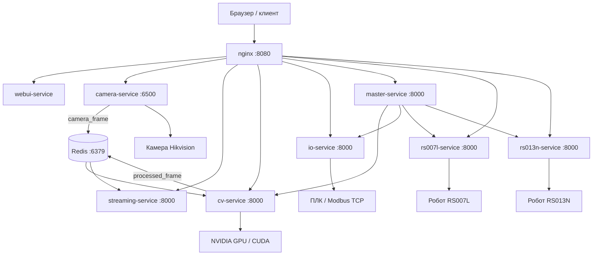

# SW001-ALKU

Система технического зрения и управления роботизированным участком. Проект получает изображения с промышленной камеры Hikvision, выполняет калибровку и распознавание деталей с помощью YOLO/OpenCV, передаёт результаты роботам и управляет промышленными входами/выходами.

## Возможности

- получение кадров с камеры Hikvision;
- оптическая и ArUco-калибровка;
- детектирование объектов и распознавание позы через Ultralytics YOLO;
- обработка изображений на NVIDIA GPU с CUDA/cuDNN;
- переключение моделей и порогов уверенности во время работы;
- выдача исходного или обработанного MJPEG-потока;
- управление роботами RS007L и RS013N;
- работа с промышленными I/O через Modbus TCP;
- единый веб-интерфейс и HTTP API.

## Архитектура



### Поток обработки изображения

```text
Камера Hikvision
  -> camera-service
  -> Redis: camera_frame
  -> cv-service / YOLO / OpenCV
  -> Redis: processed_frame
  -> streaming-service
  -> nginx
  -> Web UI
```

`master-service` является оркестратором производственного процесса: получает команды от интерфейса, проверяет состояние компонентов, запрашивает координаты объектов у `cv-service`, управляет роботами и отправляет команды в `io-service`.

## Сервисы

| Сервис | Назначение | Внутренний порт | Внешний маршрут |
|---|---|---:|---|
| `nginx` | Единая точка входа и reverse proxy | 80 | `http://localhost:8080` |
| `webui-service` | Веб-интерфейс оператора | 8000 | `/` |
| `camera-service` | Камера, коррекция кадров, Redis | 6500 | `/api/camera` |
| `cv-service` | YOLO, OpenCV, калибровка, обработка кадров | 8000 | `/api/cv` |
| `streaming-service` | MJPEG-поток из Redis | 8000 | `/api/streaming` |
| `master-service` | Оркестрация производственного процесса | 8000 | `/api/master` |
| `io-service` | Промышленные входы/выходы Modbus TCP | 8000 | `/api/io` |
| `rs007l-service` | HTTP API и TCP-протокол робота RS007L | 8000 / 9007 | `/api/rs007l` |
| `rs013n-service` | HTTP API и TCP-протокол робота RS013N | 8000 / 9013 | `/api/rs013n` |
| `redis` | Передача кадров и обмен состоянием | 6379 | `localhost:6379` |

HTTP API сервисов запускается через Uvicorn. Реализация каждого API находится в соответствующем `app/main.py`.

## Образы Docker

Большинство сервисов используют общий образ `alku-base-image`:

```text
python:3.13
  -> alku-base-image
      -> camera-service
      -> webui-service
      -> streaming-service
      -> master-service
      -> io-service
      -> rs007l-service
      -> rs013n-service
```

`cv-service` использует отдельный GPU-образ:

```text
ultralytics/ultralytics:8.3.204
  -> alku-cv-image
      -> cv-service
```

`alku-cv-image` содержит CUDA Toolkit 12.6, cuDNN и OpenCV 4.10.0, собранный с поддержкой CUDA. В Compose для `cv-service` указан `runtime: nvidia`, поэтому для полноценной работы требуется NVIDIA GPU, драйвер и NVIDIA Container Toolkit.

`alku-cv-image-nocuda` предназначен для CPU-варианта, но в текущем `docker-compose.yml` не используется.

## Требования

- Docker Engine с поддержкой Compose;
- Linux-сервер или Docker Desktop с корректно настроенной виртуализацией;
- для `cv-service`: совместимая NVIDIA GPU, драйвер и NVIDIA Container Toolkit;
- промышленная камера Hikvision и установленный SDK;
- доступ к оборудованию по сети:
  - камера: адрес задаётся в `data/config.json`;
  - Modbus-устройство: адрес задаётся в конфигурации `io-service`;
  - роботы RS007L и RS013N: TCP-порты `9007` и `9013`;
- заполненный локальный файл `.env`.

Не добавляйте секреты и пароли в Git. Используйте `.env` локально или секреты CI/CD.

## Запуск

Соберите базовые образы, если их ещё нет локально:

```powershell
docker build -t alku-base-image -f alku-base-image/Dockerfile .
docker build -t alku-cv-image -f alku-cv-image/Dockerfile .
```

Сборка `alku-cv-image` может занимать значительное время, поскольку OpenCV компилируется из исходников.

Запустите весь стек:

```powershell
docker compose up -d --build
```

Проверьте состояние контейнеров и логи:

```powershell
docker compose ps
docker compose logs --tail=100 cv-service
docker compose logs --tail=100 camera-service
```

Веб-интерфейс доступен по адресу:

```text
http://localhost:8080
```

Остановка:

```powershell
docker compose down
```

## Проверка API

```powershell
curl http://localhost:8080/api/camera/health
curl http://localhost:8080/api/cv/get_state
curl http://localhost:8080/api/cv/get_models_list
curl http://localhost:8080/api/master/health
```

Основные операции CV:

```powershell
curl -X POST http://localhost:8080/api/cv/calibrate
curl -X POST http://localhost:8080/api/cv/uncalibrate
curl http://localhost:8080/api/cv/get_objects
curl http://localhost:8080/api/streaming/stream
```

Полная интерактивная документация FastAPI доступна у сервисов по маршрутам `/docs` и `/redoc` через соответствующий API-префикс, например:

```text
http://localhost:8080/api/cv/docs
http://localhost:8080/api/master/docs
```

Документация использует `FastAPIOffline`, поэтому статические ресурсы Swagger UI и ReDoc доступны без загрузки с внешнего CDN.

## Модели и данные

Каталог `data/` монтируется в контейнеры как `/data` и содержит:

- `config.json` — параметры камеры, моделей, отображения и процесса;
- `models/` — веса YOLO в формате `.pt`;
- `postprocessors/` — обработчики результатов для конкретных моделей;
- `calibration_matrix.npy` — данные ArUco-калибровки;
- `distortion_coeffs.npz` — коэффициенты оптической дисторсии.

Имя модели, файл весов и postprocessor должны соответствовать настройкам в `data/config.json`.

## Структура проекта

```text
camera-service/       Получение и подготовка кадров
cv-service/            Компьютерное зрение и YOLO
streaming-service/    MJPEG-поток кадров
master-service/       Оркестрация процесса
io-service/            Modbus TCP и промышленный I/O
rs007l-service/       Управление роботом RS007L
rs013n-service/       Управление роботом RS013N
webui-service/        Веб-интерфейс
common/               Общие конфигурация, Redis, логирование и утилиты
alku-base-image/      Общий Python-образ
alku-cv-image/        GPU-образ для CV
Calibration/          Получение изображений и калибровка
DatasetGrabber/       Захват датасетов
Debug/                Отладочные скрипты
data/                 Модели, калибровка и конфигурация
nginx/                Reverse proxy
Robot/                Программы и файлы роботов
yolo-trainer/         Обучение моделей
```

## Запуск калибровки и обучение

Подробное руководство находится в [docs/Руководство_по_обучению_технического_зрения.md](docs/Руководство_по_обучению_технического_зрения.md).

Типовой порядок:

1. Получить изображения калибровочной мишени.
2. Выполнить оптическую и ArUco-калибровку.
3. Положить результаты в `data/`.
4. Обучить или выбрать YOLO-модель.
5. Скопировать веса в `data/models/`.
6. Добавить модель и postprocessor в `data/config.json`.
7. Перезапустить `cv-service` и проверить координаты объектов.
8. Выполнить безопасную проверку взаимодействия с роботами и I/O.

## Сетевые зависимости и ограничения

- `camera-service`, `cv-service` и `streaming-service` используют Redis для обмена кадрами.
- `camera-service` работает в `network_mode: host` и использует `REDIS_HOST=localhost`.
- Остальные контейнеры используют сеть `alku-network` и обращаются к Redis по имени `redis`.
- `master-service` фактически зависит от CV, камеры, streaming, I/O и обоих роботов, но эти зависимости не полностью описаны через `depends_on`.
- `depends_on` в текущей конфигурации задаёт порядок запуска, но не гарантирует готовность сервиса.
- Healthcheck проверяет доступность HTTP API, но не гарантирует подключение физической камеры, ПЛК или робота.
- Если запросы через Nginx возвращают `404`, проверьте соответствие `root_path`, маршрутов FastAPI и правил `proxy_pass` в [nginx/default.conf](nginx/default.conf).

## Полезные команды

```powershell
# Полная пересборка и запуск
docker compose up -d --build

# Состояние контейнеров
docker compose ps

# Логи конкретного сервиса
docker compose logs -f cv-service

# Проверка CUDA внутри CV-контейнера
docker compose exec cv-service python -c "import torch; print(torch.cuda.is_available()); print(torch.cuda.get_device_name(0) if torch.cuda.is_available() else 'CPU')"

# Перезапуск после замены модели
docker compose restart cv-service
```

## Документация

- [Руководство по обучению технического зрения](docs/Руководство_по_обучению_технического_зрения.md)
- [Docker Compose](docker-compose.yml)
- [Конфигурация системы](data/config.json)
